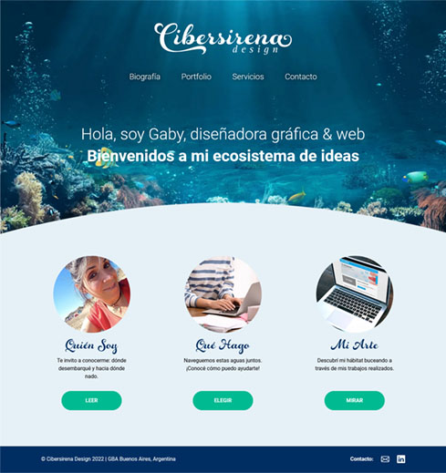

<h1>Cibersirena Design</h1>

Este es el proyecto del portfolio personal de Gabriela Monteforte, para el curso de desarrollo web en Coder House

<h2>Vista previa del proyecto <g-emoji class="g-emoji" alias="computer" fallback-src="https://github.githubassets.com/images/icons/emoji/unicode/1f4bb.png">💻</g-emoji></h2>

<h2>Construido con: <g-emoji class="g-emoji" alias="hammer_and_wrench" fallback-src="https://github.githubassets.com/images/icons/emoji/unicode/1f6e0.png">🛠️</g-emoji></h2>
<ul>
    <li>Framework Bootstrap</li>
    <li>HTML 5</li>
    <li>CSS</li>
</ul>

<h2>Tecnologías utilizadas <g-emoji class="g-emoji" alias="computer" fallback-src="https://github.githubassets.com/images/icons/emoji/unicode/1f4bb.png">💻</g-emoji></h2>
<ul>
    <li>SASS</li>
    <li>GIT</li>
    <li>GITHUB</li>
    <li>NODE</li>
</ul>

<h2>Autor <g-emoji class="g-emoji" alias="black_nib" fallback-src="https://github.githubassets.com/images/icons/emoji/unicode/2712.png">✒️</g-emoji></h2>

Gabriela Monteforte, 2022
